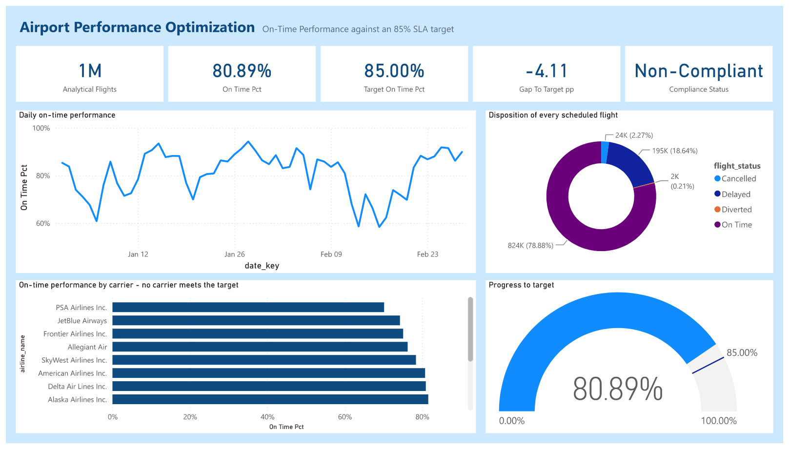
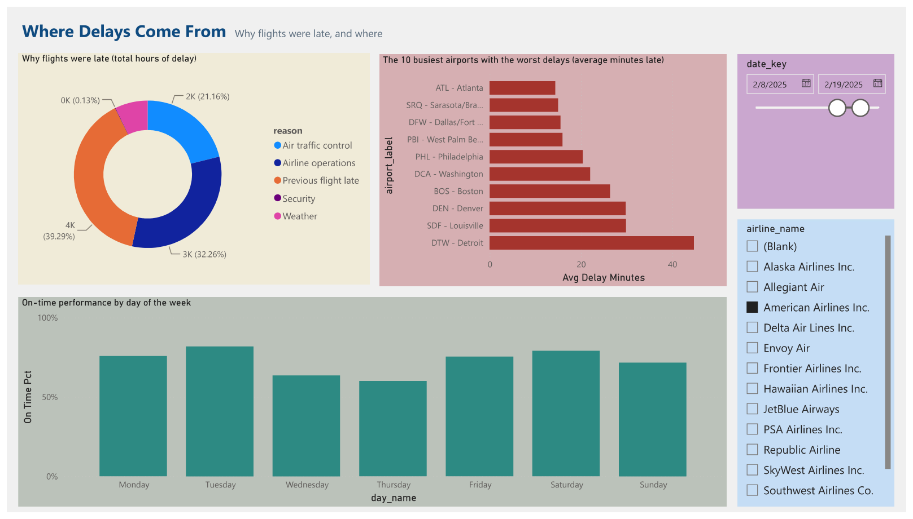

# Airport Performance Optimization

End-to-end data engineering and analytics pipeline over **1,044,631 real US flight
records**. Raw government data through cleaning, integration, dimensional
modelling, MySQL and MongoDB, surfaced in a Power BI dashboard connected live to
the warehouse.

**Question:** is the airport network meeting an 85% on-time standard?
**Answer:** 80.89% — **Non-Compliant** by 4.11 percentage points.

---

## Result

| Metric | Value |
|---|---|
| Analysis window | 1 Jan – 28 Feb 2025 |
| Scheduled flights | 1,044,631 |
| Flights measured | 1,018,745 |
| On time (arrival delay ≤ 15 min) | 824,030 |
| **On-time performance** | **80.89%** |
| Target | 85.00% |
| Gap | −4.11 pp |
| **Verdict** | **Non-Compliant** |

330 airports · 14 carriers · 5,705 aircraft · 607,294 weather observations.

Every figure is computed by the pipeline and independently reproduced in pandas,
SQL and MongoDB before it is reported.

---

## Key findings

**~71% of all delay is carrier-controllable or propagated** from a late inbound
aircraft. Weather accounts for under 8%. Most delay is operational, not
environmental.

**Only one carrier meets the 85% target.** Hawaiian 85.6%, Southwest 84.8%,
PSA 70.2%.

**80 of 330 airports** meet the target. Failure concentrates in large connecting
hubs rather than spreading evenly across the network.

---

## Dashboard

Power BI reading the MySQL views live. Two pages.

**1. Performance Overview** — the headline verdict against the 85% target.



**2. Where Delays Come From** — attribution by cause, airport and weekday.
Shown with the date and carrier slicers active.



---

## Architecture

```
BTS / FAA / NOAA-network
        │
        ├─ 01a, 01b   acquire          →  immutable landing zone
        ├─ 02         profile          →  QA report
        ├─ 03         clean            →  curated files
        ├─ 04         integrate        →  staging + merge audits
        ├─ 05, 05b    normalize        →  9 entities
        ├─ 06         load             →  MySQL, foreign keys enforced
        ├─ 07         ETL              →  KPI, cross-checked in SQL
        └─ 08         reconcile        →  MongoDB, second engine
                                            │
                     SQL views  ←───────────┘
                         │
                     Power BI  (live connection, DAX measures)
```

Power BI connects **directly to the MySQL views** defined in
`sql/04_powerbi_views.sql`. The views are the contract between the warehouse and
the report: change a view and the dashboard follows, with no code to edit.

### Data model

Nine tables, 51 columns. `Flight` is the fact; everything else describes it.

| Table | Rows | Source |
|---|---|---|
| `Flight` | 1,044,631 | BTS On-Time Performance |
| `Weather` | 607,294 | Iowa Environmental Mesonet ASOS/METAR |
| `Aircraft` | 5,705 | FAA Releasable Aircraft Registry |
| `Airport` | 330 | BTS `L_AIRPORT` |
| `Airline` | 14 | BTS `L_UNIQUE_CARRIERS` |
| `KPIThreshold` | 1 | Business rule, disconnected by design |
| `Passenger` | 204,178 | **Synthetic** |
| `BoardingPass` | 248,903 | **Synthetic** |
| `Baggage` | 154,327 | **Synthetic** |

---


### Data-quality defects handled

Found by profiling the real sources. Each one silently corrupts a join or a KPI
if missed.

| Defect | Resolution |
|---|---|
| BTS drops the leading `N` from some tail numbers (`188NV` = `N188NV`) | Normalized to FAA canonical form; aircraft match 83% → 97.7% where a tail number is present |
| FAA registry files are UTF-8 with a BOM | Read with `utf-8-sig` |
| BTS lookups are latin-1, not UTF-8 | Explicit per-source encoding |
| Flight times are airport-local; weather is UTC | Converted via each airport's IANA timezone before matching |
| Weather station ids ≠ IATA codes for AK, HI, PR, Pacific and 9 mainland fields | 38-airport crosswalk; coverage 306 → 344 airports |
| Visibility reported as 14,007 miles; dewpoint at −140 °F | Row retained and flagged; the impossible measurement nulled |
| Cancelled and diverted flights have NULL arrival delay | Excluded from the denominator, reported separately |
| Clock time `2400`; arrival earlier than departure on overnight flights | Normalized and rolled forward |

### Validation

- **Merge validation** — relationship type asserted (`validate="m:1"`), row count
  compared before and after, unmatched rate recorded. Row count is preserved
  exactly across all five merges.
- **Referential integrity** — zero orphans. The load runs with foreign keys
  enabled, so a successful load is itself the proof.
- **Cross-engine reconciliation** — the KPI is computed independently in pandas,
  SQL and MongoDB's aggregation framework. Disagreement fails the stage.
- **Additivity** — per-airport and per-day subtotals must sum to the network
  total.

### Design decisions

**Classification happens once, upstream.** `is_on_time` is computed during
cleaning, not in SQL or DAX. One definition, verified identical across three
engines. A rule living in a measure can drift from the database silently.

**The business rule lives in a table.** The 15-minute threshold and the 85%
target appear in exactly one row of `KPIThreshold`, exposed to the report as a
disconnected table and read with `SELECTEDVALUE`. No query, transform or measure
hardcodes them.

**Power BI reads views, not tables.** The semantic layer is defined in SQL, so
the report never depends on the physical schema.

**Surrogate keys over natural keys.** Business keys change — ICAO `KPBI` was
redesignated `DJT` during development. A surrogate `airport_id` is unaffected.

**Correctness over load speed.** The Flight load takes ~10 minutes because
foreign keys are validated on insert. `LOAD DATA INFILE` with deferred
constraints would be faster and would prove nothing.

---

## Data provenance

**Real:** `Flight`, `Airport`, `Airline`, `Aircraft`, `Weather` — US DOT Bureau
of Transportation Statistics, the FAA Releasable Aircraft Registry, and the Iowa
Environmental Mesonet ASOS/METAR archive.

**Synthetic:** `Passenger`, `BoardingPass`, `Baggage`. Per-passenger records are
PII and are not published by any source — passenger name records are purged
roughly three months after travel. The published alternatives are all coarser
than one row per passenger: BTS DB1C gives real ticket coupons but keyed to
carrier, route and month with no flight number; BTS T-100 aggregates per segment
per month; TSA claims data covers only mishandled bags and ends in 2017.

Rather than present any of those as per-passenger data, this layer is generated
against real flight keys and labelled synthetic in the code, the schema comments
and the documentation.

---

## Limitations

- Two months of data — no seasonality, and January–February is a winter window.
- US domestic carriers only.
- Weather is matched at the origin at scheduled departure, so en-route and
  destination conditions are not modelled.
- 0.32% of flights carry no aircraft attributes: no tail number in the source, or
  a registration absent from the FAA file.
- `Aircraft.airline_id` is derived from operational data. The FAA records the
  legal registrant, which for airline fleets is usually a leasing trust.

## Stack

Python 3.12 (pandas, SQLAlchemy) · MySQL 8.0 · MongoDB 8.0 · Power BI

## Sources

- [BTS Reporting Carrier On-Time Performance](https://transtats.bts.gov/PREZIP/)
- [FAA Releasable Aircraft Registry](https://registry.faa.gov/database/ReleasableAircraft.zip)
- [Iowa Environmental Mesonet ASOS/METAR](https://mesonet.agron.iastate.edu/request/download.phtml)
- [OurAirports](https://ourairports.com/data/) · [OpenFlights](https://openflights.org/data.html)
